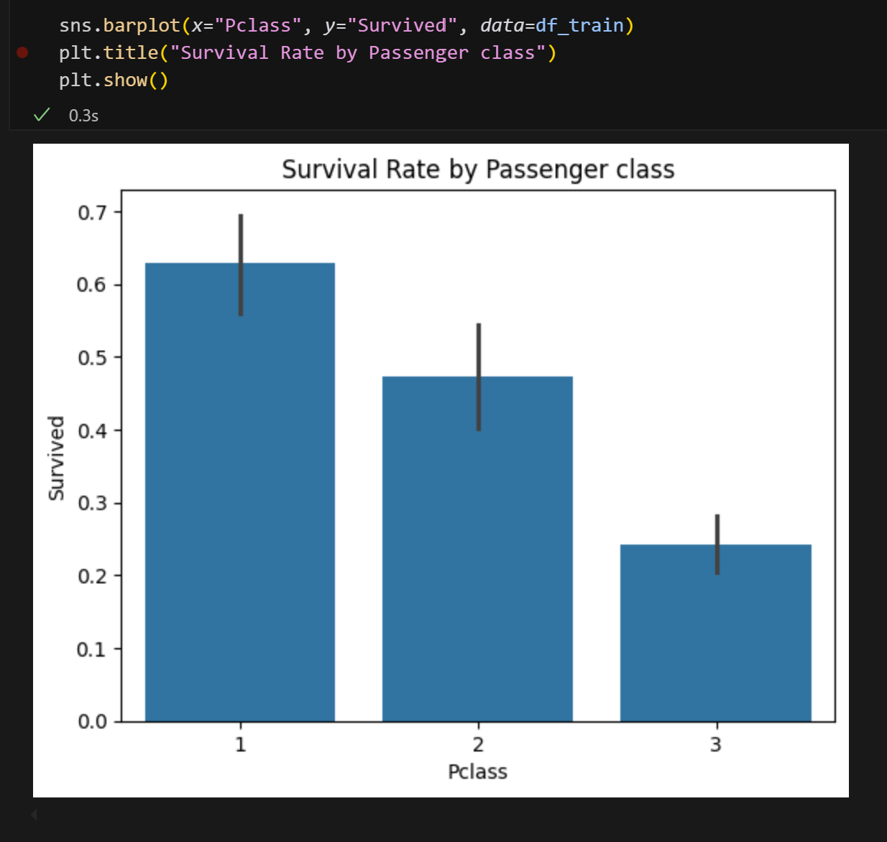
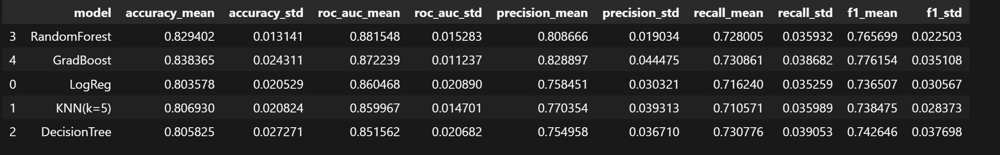
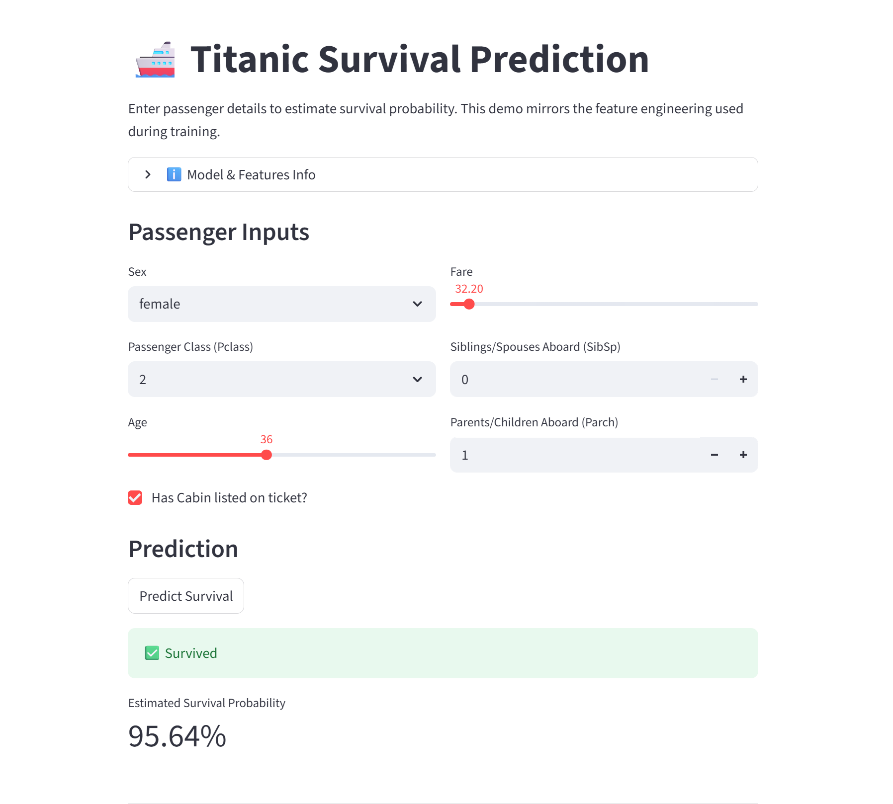

# Titanic Survival Prediction 🚢

Predict whether a passenger survived the Titanic disaster using **EDA**, **feature engineering**, and multiple **machine learning** models. Includes a **Streamlit** web app so anyone can try predictions live.

  
  
  

---

## 🖼️ Preview

| EDA: Survival by Passanger Class | Model Leaderboard | Streamlit App |
|---|---|---|
|  |  |  |

---

## 🔗 Quick Links

- 🌐 **Live demo:** https://titanic-prediction-project.streamlit.app/  
- 📓 **Notebook:** `titanic_project.ipynb`  
- 🧠 **Model code:** `pipeline.py`  
- 🧩 **Features:** `features.py`

---

## 📊 Dataset

- **Source:** [Kaggle Titanic Dataset](https://www.kaggle.com/c/titanic)  
- **Core features used:** `Age`, `Sex`, `Pclass`, `LogFare`, `FamilySize`, `HasCabin`, plus one-hot dummies for `Pclass` (`Pclass_1/2/3`)  
- **Target:** `Survived` (0 = No, 1 = Yes)

---

## ⚙️ Workflow

1. **EDA** to understand class imbalance and key survival drivers.  
2. **Data cleaning & preprocessing**  
   - Imputed **Age** via *Title-based medians*, **Embarked** via *mode*, **Fare** via *median*.  
   - Engineered: **`FamilySize`**, **`HasCabin`**, **`Title`**, **`LogFare`**.  
   - One-hot encoded **`Pclass`**.  
3. **Modeling** with a compact pipeline: **Logistic Regression**, **KNN**, **Decision Tree**, **Random Forest**, **Gradient Boosting**.  
4. **Evaluation** via **Stratified K-Fold** (Accuracy, ROC AUC, Precision, Recall, F1).  
5. **Deployment** of the selected model using **Streamlit**.

---

## 🔎 EDA Highlights

- Survival is **imbalanced** (~62% died, ~38% survived).  
- **Gender** and **class** are dominant signals: females and 1st-class passengers had much higher survival rates.  
- **Age** matters (children fared better); **Fare** (log-scaled) adds signal.

---

## 🤖 Models Compared

Implemented in `pipeline.py` with simple constructors and a shared `evaluate_models` helper:

- **Logistic Regression** (baseline, interpretable; scaled)  
- **K-Nearest Neighbors (KNN)** (distance-based; scaled)  
- **Decision Tree** (interpretable splits)  
- **Random Forest** (bagged trees; robust)  
- **Gradient Boosting** (sequential trees; strong accuracy)

### 📈 Cross-Validation Results (5-fold)

| Model               | Accuracy (mean) | ROC AUC (mean) | F1 (mean) |
|---------------------|:---------------:|:--------------:|:---------:|
| **Random Forest**   | 0.829           | **0.882**      | 0.766     |
| **Gradient Boosting** | **0.838**     | 0.872          | **0.776** |
| Logistic Regression | 0.804           | 0.860          | 0.737     |
| KNN (k=5)           | 0.807           | 0.860          | 0.738     |
| Decision Tree       | 0.806           | 0.852          | 0.743     |

> **Takeaway:** Ensemble models performed best. **Gradient Boosting** led in accuracy/F1, while **Random Forest** achieved the highest ROC AUC.

---

## ✅ Conclusion

- **EDA** confirmed class imbalance and highlighted **Sex** and **Pclass** as key drivers, with **Age** also important.  
- Missing data were handled with sensible imputations; engineered features (**FamilySize**, **HasCabin**, **LogFare**, **Title**) improved signal.  
- Among five models, **ensemble methods (Random Forest, Gradient Boosting)** performed best, capturing non-linear relationships.  
- The selected model was deployed via a **Streamlit** app for interactive predictions.

---
